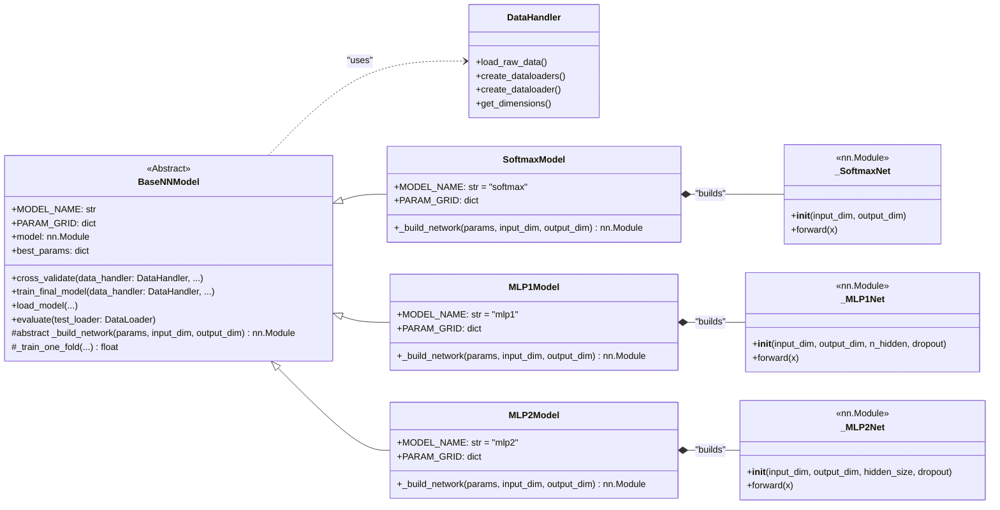

```mermaid
classDiagram
    direction LR

    class DataHandler {
        +load_raw_data()
        +create_dataloaders()
        +create_dataloader()
        +get_dimensions()
    }

    class BaseNNModel {
        <<Abstract>>
        +MODEL_NAME: str
        +PARAM_GRID: dict
        +model: nn.Module
        +best_params: dict
        +cross_validate(data_handler: DataHandler, ...)
        +train_final_model(data_handler: DataHandler, ...)
        +load_model(...)
        +evaluate(test_loader: DataLoader)
        #abstract _build_network(params, input_dim, output_dim) nn.Module
        #_train_one_fold(...) float
    }

    class SoftmaxModel {
        +MODEL_NAME: str = "softmax"
        +PARAM_GRID: dict
        +_build_network(params, input_dim, output_dim) nn.Module
    }
    class _SoftmaxNet {
        <<nn.Module>>
        +__init__(input_dim, output_dim)
        +forward(x)
    }

    class MLP1Model {
        +MODEL_NAME: str = "mlp1"
        +PARAM_GRID: dict
        +_build_network(params, input_dim, output_dim) nn.Module
    }
    class _MLP1Net {
        <<nn.Module>>
        +__init__(input_dim, output_dim, n_hidden, dropout)
        +forward(x)
    }

    class MLP2Model {
        +MODEL_NAME: str = "mlp2"
        +PARAM_GRID: dict
        +_build_network(params, input_dim, output_dim) nn.Module
    }
    class _MLP2Net {
        <<nn.Module>>
        +__init__(input_dim, output_dim, hidden_size, dropout)
        +forward(x)
    }

    %% --- Relationships ---

    %% Inheritance (Subclass points to Superclass)
    BaseNNModel <|-- SoftmaxModel
    BaseNNModel <|-- MLP1Model
    BaseNNModel <|-- MLP2Model

    %% Composition/Build (Handler contains/builds internal Net)
    %% Corrected Label Syntax: OriginClass <relationship> TargetClass : "Label Text"
    SoftmaxModel *-- _SoftmaxNet : "builds"
    MLP1Model    *-- _MLP1Net    : "builds"
    MLP2Model    *-- _MLP2Net    : "builds"

    %% Usage/Dependency (Base uses DataHandler)
    BaseNNModel ..> DataHandler : "uses"
```